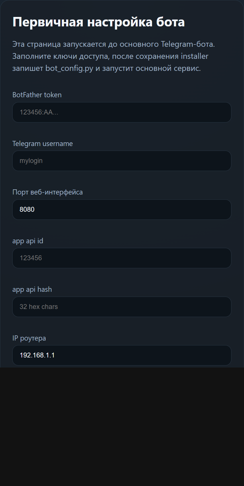
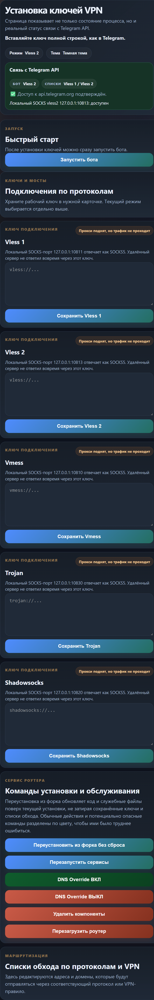
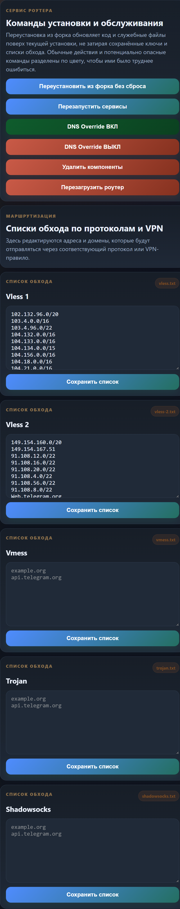

<a href="https://t.me/bypass_keenetic"></a>

## Об этом форке
Это форк проекта `keenetic-dev/bypass_keenetic_dev`.
- поддержка на [форуме](https://forum.keenetic.com/topic/14672-%D0%BE%D0%B1%D1%85%D0%BE%D0%B4%D0%B0-%D0%B1%D0%BB%D0%BE%D0%BA%D0%B8%D1%80%D0%BE%D0%B2%D0%BE%D0%BA-%D0%BC%D0%BD%D0%BE%D0%B3%D0%BE-%D0%BD%D0%B5-%D0%B1%D1%8B%D0%B2%D0%B0%D0%B5%D1%82) и [чате телеграм](https://t.me/bypass_keenetic)
- [Полное описание читайте в оригинальной вики](https://github.com/znetworkx/bypass_keenetic/wiki)

В текущем форке добавлены:
- веб-интерфейс установки ключей и мостов
- выбор маршрутизации Telegram через локальный VPN/прокси
- поддержка VLESS вместе с Shadowsocks, Trojan и Vmess
- поддержка двух отдельных маршрутов VLESS с разными ключами и списками сайтов
- дальнейшее обновление одним кликом

## Установка (~30-60 минут с нуля)
- [Установка Entware](https://github.com/znetworkx/bypass_keenetic/wiki/Install-Entware-and-Preparation)

## Быстрый bootstrap после Entware
Если Entware уже установлен и `/opt` готов, достаточно один раз зайти на роутер по SSH любым клиентом, например PuTTY, и запустить bootstrap-команду. Дальше интерактивная первичная настройка продолжится уже через браузер на странице роутера, без ручной загрузки файлов через PuTTY.

Интерактивный запуск:

```sh
sh -c 'export PATH=/opt/bin:/opt/sbin:$PATH; OPKG="$(command -v opkg || echo /opt/bin/opkg)"; CURL_BIN="$(command -v curl || echo /opt/bin/curl)"; if [ ! -x "$CURL_BIN" ]; then "$OPKG" update && "$OPKG" install curl ca-bundle || exit 1; CURL_BIN="$(command -v curl || echo /opt/bin/curl)"; fi; "$CURL_BIN" -fsSL https://raw.githubusercontent.com/andruwko73/bypass_keenetic/main/bootstrap/install.sh | sh'
```

После этого откроется страница первичной настройки на `http://192.168.1.1:8080/`, где пользователь введёт BotFather token, username, app api id и app api hash. Затем installer сохранит `bot_config.py` и запустит основной бот.

Скриншот страницы первичной настройки:

<a href="docs/screenshots/installer-setup.png">
	
</a>

Перед заменой live-файлов bootstrap создаёт локальный backup на роутере и генерирует rollback-скрипт в `/opt/root/bypass-last-rollback.sh`.

Если `bot_config.py` отсутствует, сервис бота автоматически запускает installer вместо основного Telegram-бота. После сохранения настроек installer сам переключает роутер обратно на основной сервис.

Повторный запуск bootstrap в режиме первичной настройки теперь принудительно убирает старый `bot_config.py`, чтобы страница initial setup не использовала прежний token от уже установленного бота.

Во время такой clean install старые `bot_config.py` не попадают в bootstrap rollback и не восстанавливаются автоматически: чувствительные токены и api-ключи должны вводиться заново через installer или передаваться явно через переменные окружения bootstrap.

Ограничение: подготовку накопителя и установку Entware этот bootstrap не отменяет, потому что на Keenetic Entware живёт в `/opt` и обычно требует внешнее хранилище.

## Шаблоны списков
- [vless.txt](vless.txt) — готовый шаблон списка доменов для первого маршрута VLESS: Telegram и связанная инфраструктура.
- [vless-2.txt](vless-2.txt) — готовый шаблон списка доменов для второго маршрута VLESS: GitHub Copilot, GitHub, инфраструктура VS Code/Microsoft и расширенный набор адресов Telegram.

## Как работает бот на странице 192.168.1.1:8080

После bootstrap или обычной установки бот поднимает локальную HTTP-страницу на роутере. Эта страница нужна для повседневного управления, когда не хочется каждый раз заходить по SSH и редактировать файлы вручную.

Что доступно на странице:
- проверка связи с Telegram API и отображение текущего режима бота;
- сохранение ключей **Vless 1**, **Vless 2**, **Vmess**, **Trojan** и **Shadowsocks**;
- переключение активного режима для самого Telegram-бота;
- редактирование списков обхода по протоколам;
- служебные команды: обновление из форка без сброса, перезапуск сервисов, DNS override, удаление компонентов и перезагрузка.

Типовой сценарий работы:
1. Откройте в браузере `http://192.168.1.1:8080/`.
2. Вставьте ключ в карточку нужного протокола и нажмите кнопку сохранения.
3. При необходимости отредактируйте список доменов в блоке **Списки обхода по протоколам и VPN**.
4. Переключите режим кнопкой **Режим** в верхней части страницы.
5. Проверьте блок **Связь с Telegram API**: там видно, проходит ли трафик и каким маршрутом сейчас работает бот.

### Скриншоты интерфейса

Общий вид страницы с блоком статуса, запуском и карточками ключей:

<a href="docs/screenshots/web-ui-overview.png">
	
</a>

Нижняя часть страницы со списками обхода и сервисными командами:

<a href="docs/screenshots/web-ui-lists.png">
	
</a>
